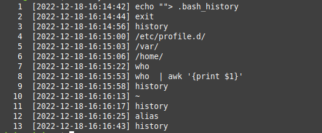

# Customize Your Linux Terminal - Shell




## This tutorial is a simple guide for personalization the linux terminal.

### Intalation

```

#Download the and Extract the files

wget https://github.com/KeystoneDevBr/shell_custom/archive/refs/heads/main.zip

unzip main.zip

# Copy the file shell_custom.sh for  directory /etc/profile.d/

cp shell_custom.sh /etc/profile.d/shell_custom.sh

```

```
# For each user, add the execution in the End of file ~/.bashrc

if [ -f  /etc/profile.d/shell_custom.sh ]; then
    . /etc/profile.d/shell_custom.sh
fi

``
